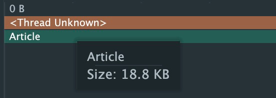
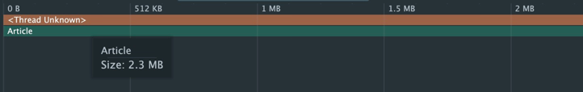

# Paging Basic CodeLab

코드랩을 통해 Paging3 라이브러리를 사용하는 방법을 배워봅니다.

## Paging 이유

> 페이징이란 데이터를 가져올 때 한 번에 모든 데이터를 가져오는 것이 아니라 일정한 단위로 나눠서 가져오는 것을 뜻합니다.  
> 일정한 단위로 나누는 행위를 `Chunking` 이라고 합니다.

일반적으로 대량의 데이터를 사용자에게 보여주는 가장 일반적인 UI 는 목록 형태로 나타내는 것이다.  
사용자는 대량의 데이터가 밑에 있을 것이라 예측하고 스크롤을 내리면서 원하는 데이터를 찾을 것이다.  
이때, 스크롤을 내리면서 lagging이나 freezing 이 발생할 경우 사용자에게 좋지 않은 경험을 줄 수 있다.

따라서 '**페이징 기법**'을 활용한 '**점진적 로드**'를 통해 앱 성능 향상을 끌어올리자!  
페이징 기법을 활용하면 앱에서 많은 양의 데이터를 한 번에 메모리에 저장할 필요가 없어진다.

데이터에 대한 페이징 처리는 '**Paging3 라이브러리**'를 활용하여 구현할 수 있다.

- 목표: '**Paging3 라이브러리**'를 활용하여 500 개의 아티클을 메모리에 로드하고, RecyclerView 에 표시합니다.

# Paging 라이브러리의 핵심 구성요소

Paging 라이브러리의 핵심 구성요소는 다음과 같습니다.

`PagingSource`: 특정 페이지 쿼리의 데이터 청크를 로드하는 기본 클래스입니다. 데이터 레이어의 일부이며 일반적으로 DataSource 클래스에서 노출되고 이후에
ViewModel에서 사용하기 위해 Repository에 의해 노출됩니다.
`PagingConfig`: 페이징 동작을 결정하는 매개변수를 정의하는 클래스입니다. 여기에는 페이지 크기, 자리표시자의 사용 설정 여부 등이 포함됩니다.
`Pager`: PagingData 스트림을 생성하는 클래스입니다. PagingSource에 따라 다르게 실행되며 ViewModel에서 만들어야 합니다.
`PagingData`: 페이지로 나눈 데이터의 컨테이너입니다. 데이터를 새로고침할 때마다 자체 PagingSource로 지원되는 상응하는 PagingData 내보내기가 별도로
생성됩니다.
`PagingDataAdapter`: RecyclerView에 PagingData를 표시하는 RecyclerView.Adapter 서브클래스입니다.
PagingDataAdapter는 팩토리 메서드를 사용하여 Kotlin Flow나 LiveData, RxJava Flowable, RxJava Observable 또는 정적
목록에도 연결할 수 있습니다. PagingDataAdapter는 내부 PagingData 로드 이벤트를 수신 대기하고 페이지가 로드될 때 UI를 효율적으로 업데이트합니다.

# Profiler 를 통한 메모리 비교

Heap Dump: 특정 시점에 힙 메모리 전체의 상태를 캡처한 것

- 페이징 적용 전 (article 10,000개)

- 페이징 적용 후
