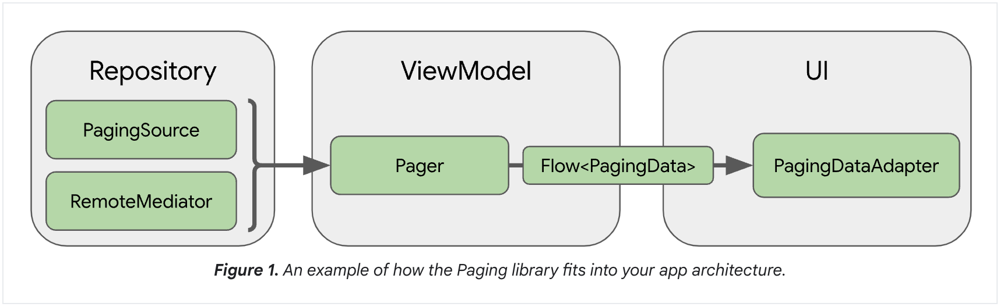
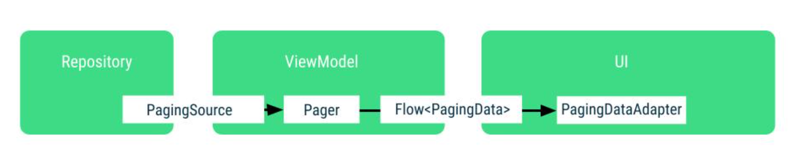

# Paging3 Overview

페이징(Paging) 라이브러리는 더 큰 데이터 세트에서 데이터 페이지를 로드하고 표시하는 데 도움이 됩니다.  
이 접근 방식을 사용하면 앱이 네트워크 대역폭과 시스템 리소스를 더 효율적으로 사용할 수 있습니다.  
페이징 라이브러리의 구성 요소는 권장되는 Android 앱 아키텍처에 맞게 설계되었습니다.
다른 제트팩(Jetpack) 컴포넌트들과 깔끔하게 통합됩니다.
코틀린 1급 클래스(first class) 를 지원합니다.

## 페이징 라이브러리 사용의 이점

페이징 라이브러리를 사용하면 다음과 같은 기능을 활용할 수 있습니다:

* 페이징된 데이터를 처리하는 데 도움이 되는 메모리 내 캐싱.
    * 이를 통해 앱이 페이징된 데이터를 처리하는 동안 시스템 리소스를 효율적으로 사용할 수 있습니다.
* 내장된 요청 중복 제거 기능.
    * 이를 통해 앱이 네트워크 대역폭과 시스템 리소스를 효율적으로 사용할 수 있습니다.
* 사용자가 로드된 데이터의 끝으로 스크롤할 때 자동으로 데이터를 요청하는 구성 가능한 RecyclerView 어댑터.
* 코틀린 코루틴 및 플로우, LiveData 및 RxJava에 대한 1급 클래스 지원
* 새로 고침 및 다시 시도 기능을 포함한 내장된 오류 처리 지원.

```toml
androidxPaging = "3.3.2"

# alternatively - without Android dependencies for tests
androidx-paging-runtime-ktx = { group = "androidx.paging", name = "paging-runtime-ktx", version.ref = "androidxPaging" }

androidx-paging-common-ktx = { group = "androidx.paging", name = "paging-common-ktx", version.ref = "androidxPaging" }

```

```groovy 
implementation libs.androidx.paging.common.ktx
implementation libs.androidx.paging.runtime.ktx
```

## 라이브러리 아키텍처

페이징 라이브러리의 컴포넌트들은 앱의 세 레이어에서 동작합니다.

* 레포지토리(repository) 레이어
* 뷰모델(ViewModel) 레이어
* UI 레이어



각 레이어에서 동작하는 페이징 라이브러리 컴포넌트와 페이징된 데이터를 로드하고 표시하는 방법에 대해 설명하겠습니다.

### 레포지토리(repository) 레이어

주요한 레포지토리 레이어에 있는 페이징 라이브러리 컴포넌트는 PagingSource(페이징 소스) 입니다.  
각 페이징 소스 객체는 데이터의 소스와 그 소스에서 데이터를 검색하는 방법을 정의합니다.  
페이징 소스 객체는 네트워크 소스와 로컬 데이터베이스를 포함한 모든 단일 소스에서 데이터를 로드할 수 있습니다.

또 다른 페이징 라이브러리 컴포넌트로 RemoteMediator 를 사용할 수도 있습니다.  
RemoteMediator 객체는 로컬 데이터베이스 캐시와 같은 계층화된 데이터 소스에서 페이징을 처리합니다.

### 뷰모델(ViewModel) 레이어

페이징 컴포넌트는 페이징 데이터의 인스턴스를 구성하는 API 를 제공합니다.  
이 PagingData(페이징 데이터)는 반응형(reactive) 스트림에 노출되며, PagingSource 객체와 PagingConfig 구성 객체를 기반으로 합니다.

뷰모델 레이어를 UI 에 연결하는 컴포넌트는 PagingData 입니다.  
페이징 데이터 객체는 페이징된 데이터의 스냅샷을 포함하는 컨테이너입니다.  
PagingSource 객체를 쿼리하고 결과를 저장합니다.

### UI 레이어

UI 레이어의 주요 페이징 라이브러리 컴포넌트는 PagingDataAdapter 입니다.  
PagingDataAdapter 는 페이지별 데이터를 처리하는 RecyclerView 어댑터입니다.
대신에 AsyncPagingDataDiffer 컴포넌트를 사용하여 사용자 정의 어댑터를 만들 수 있습니다.

> 만약 UI 에서 컴포즈를 사용한다면, androidx.paging:paging-compose 라는 아티팩트를 사용할 수 있습니다.

## 페이지네이션(Pagination) 소개

유저에게 정보를 제공하는 가장 일반적인 방법 중 하나는 리스트를 사용하는 것입니다.
사용자가 리스트를 스크롤할 때 더 많은 데이터가 자동으로 로드될 것으로 예상됩니다.  
데이터가 가져올 때마다 효율적이고 원활해야 하며, 점진적인 로드가 UX(사용자 경험)을 해치지 않아야 합니다.
점진적인 로드는 앱이 한 번에 많은 양의 데이터를 메모리에 보유할 필요가 없어집니다.
즉, 성능상의 이점을 제공합니다.

이렇게 점진적으로 정볼르 가져오는 프로세스를 페이지네이션(Pagination) 이라고 합니다.
각 페이지는 가져올 데이터의 청크(chunk)에 해당합니다.
페이지를 요청하려면, 페이징되는 데이터 소스는 종종 필요한 정보를 정의하는 쿼리가 필요합니다.
이제 간단히 페이징을 구현해봅시다.

## 페이징 라이브러리의 코어 컴포넌트들

* `PagingSource`
    * 특정 페이지 쿼리에 대한 데이터 청크를 로드하는 기본 클래스입니다.
    * 데이터 레이어의 일부이며, 데이터 소스(DataSource) 클래스에서 노출되고, 이후에 뷰모델에서 사용하기 위해 노출됩니다.
* `PagingConfig`
    * 페이징 동작을 결정하는 매개변수를 정의하는 클래스입니다.
    * 페이지 크기, 플레이스홀더 활성화 여부 등을 포함합니다.
* `Pager`
    * `PagingData` 스트림을 생성하는 책임을 지는 클래스입니다.
    * 이를 수행하기 위해 `PagingSource`에 의존하며, 뷰모델에서 생성되어야 합니다.
* `PagingData`
    * 페이지별 데이터를 위한 컨테이너입니다.
    * 데이터의 각 새로 고침은 자체 `PagingSource`에 의해 지원되는 별도의 `PagingData` 방출을 가집니다.
* `PagingDataAdapter`
    * 리사이클러뷰(RecyclerView)에 `PagingData`를 제공하는 `RecyclerView.Adapter` 하위 클래스입니다.
    * `PagingDataAdapter`는 Kotlin `Flow`, `LiveData`, `RxJava Flowable`, `RxJava Observable` 또는 팩토리
      메서드를 사용하여 정적 목록에 연결될 수 있습니다.
    * `PagingDataAdapter`는 내부 `PagingData` 로딩 이벤트를 수신하고 페이지가 로드될 때 효율적으로 UI를 업데이트합니다.



## Practice

PagingSource 만드려면 아래를 정의해야 함.

* 페이징 키의 타입 - 더 많은 데이터를 요청하는 데 사용되는 페이지 쿼리의 타입을 정의합니다.
  우리의 경우, ID가 정렬되고 증가된다는 것이 보장됩니다. 그러므로 특정 게시물 ID 이후 또는 이전의 게시물을 가져옵니다.
* 로드되는 데이터 타입 - 각 페이지는 게시물 목록을 반환하므로 타입은 게시물(Article)입니다.
* 데이터가 검색되는 곳 - 일반적으로 데이터베이스, 네트워크 리소스 또는 페이지별 데이터의 다른 소스가 될 수 있습니다.
  그러나 이 코드랩의 경우, 로컬로 생성된 데이터를 사용합니다.

### PagingSource

PagingSource 는 load() 와 getRefreshKey() 두 가지 함수를 구현해야 합니다.
load() 함수는 사용자가 스크롤 할 때 추가 데이터를 비동기적으로 가져 오도록 페이징 라이브러리에 의해 호출됩니다.
LoadParams 객체에는 로드 작업과 관련된 정보가 포함되어 있습니다.

* 로드 할 페이지의 키 - 이 함수가 처음 호출되는 경우 LoadParams.key는 null이 됩니다. 이 경우 초기 페이지 키를 정의해야합니다.
* 로드 크기 - 로드 할 요청 항목 수입니다.

load() 함수는 LoadResult를 반환합니다. LoadResult 는 sealed class 로 되어 잇습니다. LoadResult는 다음 중 하나 일 수 있습니다.

* LoadResult.Page, 결과가 성공한 경우.
* LoadResult.Error, 오류가 발생한 경우.
* LoadResult.Invalid: 페이징 소스가 더 이상 결과의 무결성을 보장할 수 없으므로 무효화되어야하는 경우.

LoadResult.page 는 세가지 필수 인수가 있습니다.

* data: 가져온 항목의 목록.
* prevKey: 현재 페이지 뒤에 항목을 가져 오려면 load() 메서드에서 사용하는 키입니다.
* nextKey: 현재 페이지 뒤에 항목을 가져 오려면 load() 메서드에서 사용하는 키입니다.
* ... and two optional ones

* itemsBefore: 로드 된 데이터 앞에 표시 할 플레이스 홀더 수입니다.
* itemsAfter: 로드 된 데이터 뒤에 표시 할 플레이스 홀더 수입니다.

우리의 로딩 키는 Article.id 필드입니다. Article ID는 각 게시물마다 1씩 증가하기 때문에 키로 사용할 수 있습니다.
즉, 기사 ID는 연속적으로 1씩 증가하는 정수입니다.

nextKey 혹은 prevKey 는 해당 방향으로 더 이상 데이터를로드 할 수없는 경우 null입니다.
우리의 경우 prevKey에 대해 다음과 같이합니다.

만약 startKey 가 STARTING_KEY 와 같다면, 우리는 null 을 반환합니다. 왜냐하면 이 키 뒤에 더 이상 아이템들을 로드 할 수 없기 때문입니다.
만약 startKey 가 STARTING_KEY 와 다르다면, 우리는 목록에서 첫 번째 항목을 가져 와서 그 뒤에 LoadParams.loadSize 만큼 로드해서 항상
STARTING_KEY보다 작은 키를 반환하지 않도록 합니다.
ensureValidKey() 메서드를 정의하여 이 작업을 수행합니다.
이 함수는 페이징 키가 유효한지 확인합니다.

---

이제 `getRefreshKey` 를 구현해야 함.
이 메서드는 백업 PagingSource의 데이터가 변경되서 UI를 위해 아이템들을 다시 로드해야 할 때 호출됩니다.
이 페이징 소스의 기저 데이터가 변경되어 UI에서 업데이트되어야 하는 상황을 무효화(invalidation)라고 합니다.
무효화되면 페이징 라이브러리는 새로운 PagingSource를 만들어 데이터를 다시 로드하고 새로운 PagingData를 발행하여 UI에 알립니다.

새로운 페이징 소스에서 로드할 때, getRefreshKey()가 호출되어 사용자가 새로 고침 후에 현재 리스트에서의 위치를 잃지 않도록 새로운 페이징 소스가 로드를 시작해야 하는
키를 제공합니다.

페이징 라이브러리에서 무효화는 `PagingAdapter` 에서 `refresh` 를 호출하거나 `invalidate` 를 호출했을 때 발생합니다.

반환된 키는 LoadParams argument 를 통해서 새로운 PagingSource의 load() 메서드에 전달됩니다.
무효화 이후에 아이템이 이동하는 것을 방지하기 위해, 반환된 키가 화면을 채울만큼의 아이템을 로드하는지 확인해야합니다.
이렇게 하면 새로운 아이템 세트가 무효화된 데이터에 있던 아이템을 포함할 가능성이 높아져 현재 스크롤 위치를 유지하는데 도움이 됩니다.

위 getRefreshKey 코드에서 PagingState.anchorPosition 을 사용했습니다.
만약 페이징 라이브러리가 더 많은 데이터를 어떻게 가져올 수 있는지 궁금하다면, 이것이 답입니다!
UI가 PagingData에서 항목을 읽으려고 시도하면 특정 인덱스에서 읽으려고 시도합니다.
데이터가 읽히면 그 데이터가 UI에 표시됩니다. 그러나 데이터가 없으면 페이징 라이브러리는 데이터를 가져와 실패한 읽기 요청을 충족해야 한다는 것을 알게됩니다.
데이터가 성공적으로 읽힌 가장 최근 인덱스는 anchorPosition입니다.
새로 고칠 때, anchorPosition에 가장 가까운 Article의 키를 가져와서 로드 키로 사용합니다.
이렇게 하면 새로운 PagingSource에서 다시 로드를 시작할 때 이미 로드된 항목이 포함된 항목 세트가 포함되어 부드럽고 일관된 사용자 경험을 보장합니다.
이렇게 하면 새로운 PagingSource를 완전히 정의했습니다. 다음 단계는 UI에 연결하는 것입니다.

### PagingSourceFactory

> pagingSourceFactory 람다는 항상 호출될 때마다 새로운 PagingSource를 반환해야 합니다.
> PagingSource 인스턴스는 재사용할 수 없기 때문에, 각 호출마다 새로운 PagingSource를 반환해야 합니다.
> 이는 PagingSource가 데이터 로드 상태를 유지하고, 데이터 소스가 변경될 때마다 새로운 인스턴스를 생성하여 일관된 데이터 로드를 보장하기 위함입니다.

PagingSource는 데이터 로드 중에 상태를 유지하고, 데이터 소스가 변경되면 무효화됩니다.  
따라서, 새로운 데이터 로드를 위해 항상 새로운 PagingSource 인스턴스를 반환해야 합니다.

> Note: PagingData Flows는 cold가 아니기 때문에 stateIn() 또는 sharedIn() 연산자를 사용하지 마십시오.

또한 Flow에 대한 작업을 수행하는 경우, map 또는 filter와 같은 작업을 수행한 후에 cachedIn을 호출하여 이러한 작업을 다시 트리거할 필요가 없도록 해야 합니다.

Note: `PagingData`는 `RecyclerView`에 표시할 데이터의 업데이트를 포함하는 독립적인 타입입니다.
각 `PagingData`의 발행은 완전히 독립적이며, 기본 데이터 세트의 변경으로 인해 백업 `PagingSource`가 무효화되면 단일 쿼리에 대해 여러 `PagingData`
인스턴스가 발행될 수 있습니다.
따라서, `PagingData`의 `Flow`는 다른 `Flow`와 독립적으로 노출되어야 합니다.

Note: PagingData Flow 를 다른 Flows 와 mix 하거나 combine 하지 마세요.
각 PagingData 의 발행은 독립적으로 소비되어야 합니다.

